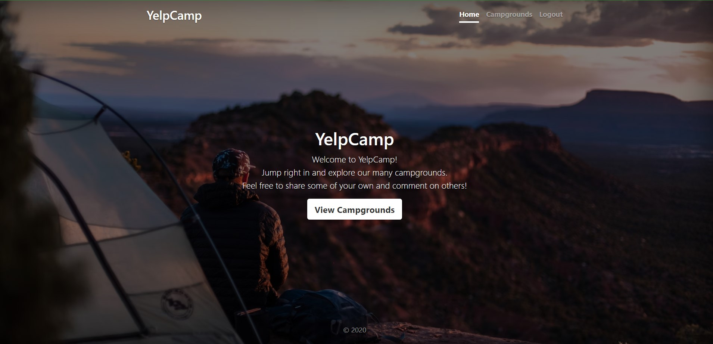
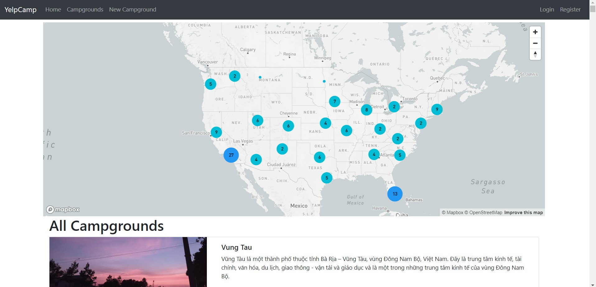

# Camp DevSecOps Project

This project demonstrates a real-time DevSecOps CI/CD pipeline for a Camp Booking Application.

## Features

- User authentication
- Camp listings
- Camp images upload using Cloudinary
- Maps integration using Mapbox
- MongoDB database integration

---

## DevSecOps Tools Used

- Git & GitHub
- Jenkins
- SonarQube
- OWASP Dependency Check
- Docker
- Trivy
- Kubernetes
- Prometheus
- Grafana
- AWS EC2

---

## CI/CD Pipeline Flow

1. Developer pushes code to GitHub
2. Jenkins pipeline triggers automatically
3. OWASP dependency scan runs
4. SonarQube code analysis runs
5. Docker image builds
6. Trivy scans Docker image
7. Application deploys to Kubernetes
8. Prometheus monitors application
9. Grafana visualizes monitoring metrics

---

## Project Structure

- Dockerfile
- Jenkinsfile
- Kubernetes Manifests
- Monitoring Configuration
- Controllers
- Models
- Routes
- Views

## Security Practices

- Secrets stored in .env
- .env excluded using .gitignore
- Container vulnerability scanning using Trivy
- Dependency vulnerability scanning using

 
## Application Screenshots

